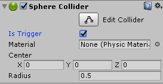

# GetComponent

GetComponent 是访问游戏对象的组件的方法，由于Unity5采用模块化思想对底层进行了重写，能够减少用户负担，原来Unity4.x定义的一些便利属性访问器被取消，所以我们调用GetComponent来访问游戏对象和组件并调整参数，而且在制作过程中使用比较多。

格式：

```
GameObject.GetComponent<type>()
```

说明：

（1）GameObject 是定义 GameObject 游戏对象的变量名。

（2）type 是组件名称，类型是 string。

下面给出了几个简单的示例，如下图示：

.png>)

.png>)

```
GetComponent<Rigidbody>().mass = 20;
//第一个例子表示 Rigidbody 组件的 mass 赋值为20；
```

.png>)



```
GetComponent<BoxCollider>().isTrigger = true;
//第二个例子表示给 BoxCollider 组件的 Is Trigger 为 true；
```

.png>)

.png>)

```
GetComponent<Test>().enabled = false;
//第三个例子表示禁用 Test 组件。
```


[https://blog.csdn.net/KillMeHealMe/article/details/88290339](https://blog.csdn.net/KillMeHealMe/article/details/88290339)
